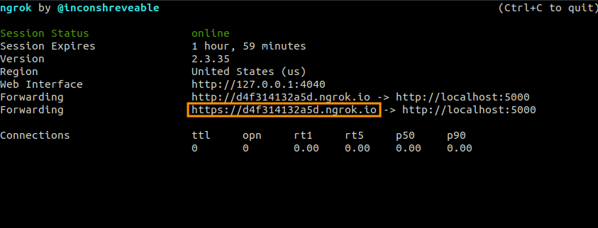
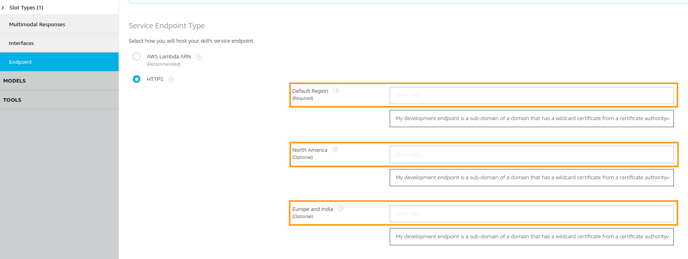

# Dependencies:

    - ngrok
    - flask-ask
    - having a akex-skill developper account.

Due to the fact that we are using ngrok, a few steps are required.
# Running:

To run this node there are a few steps required:

    1. Launch ngrok with
        ```
            ./ngrok http 5000
        ```

    2. Copy the https address generated by ngrok.
        

    3. Change the alexa skill endpoint to the one generated with ngrok/
        
